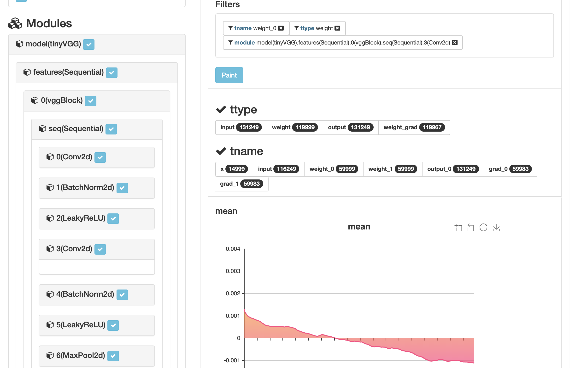

# Torch Ember
> Tracking and visualize after the burning pytorch


## This framework tracks the pytorch model:

* On ```nn.Module``` level
* Down to the metrics/ features of all tensors, includes
    * inputs/outputs of each module
    * weight tensors
* By **minimal** extra coding



## Other lovely features
* Customizable metrics, with easy decorator syntax
* Split the tracking log in the way you like, just ```mark(k=v,k1=v2...)```
* You can easily switch on/off the tracking:
    * Even cost of computation is tiny, torchember don't have to calculate metric for every iteration
    * Hence, you can track eg. only the last steps, only each 200 steps .etc

## Installation
```pip install torchember```

## Fast Tutorial

* **30 seconds** [tutorial](https://github.com/raynardj/torchember/blob/master/nb_test/test_cnn.ipynb)

* Full [documentations](https://raynardj.github.io/torchember/)

### Step1, Track your model

Place you torch ember tracker on your model

```python
from torchember.core import torchEmber
te = torchEmber(model)
```

Train your model as usual

### Step2, Check the analysis on the WebUI

Run the service from terminal
```shell
$ torchember
```
The default port will be 8080

Or assign a port
```shell
$ torchember --port=4200
```

Visit your analysis at ```http://[host]:[port]```
