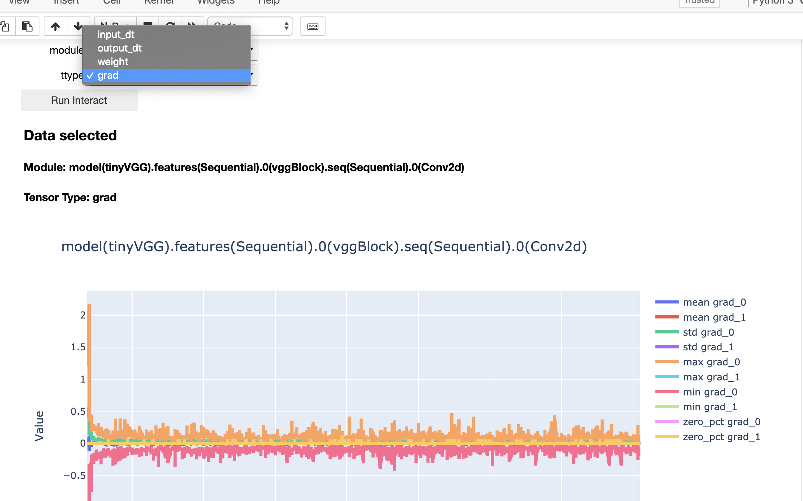

# Torch Ember
> Tracking and visualize after the burning pytorch


## This framework tracks the pytorch model:

* On ```nn.Module``` level
* Down to the metrics/ features of all tensors, includes
    * inputs/outputs of each module
    * weight/grad tensors
* By **minimal** extra coding
* Besides WebUI, Visualization compatible with **notebook** environment

## Other lovely features
* Customizable metrics, with easy decorator syntax
* Split the tracking log in the way you like, just ```mark(k=v,k1=v2...)```
* You can easily switch on/off the tracking:
    * Even cost of computation is tiny, torchember don't have to calculate metric for every iteration
    * Hence, you can track eg. only the last steps, only each 200 steps .etc

## Installation
```pip install torchember```

## Fast Tutorial

* Instant colab tutorial here: <a href="https://colab.research.google.com/github/raynardj/torchember/blob/master/nb_test/torchember_instant_tutorial.ipynb" target="_parent"></a>



* Full [documentations](https://raynardj.github.io/torchember/)

### WebUI intro Video
* [video here](https://www.youtube.com/watch?v=2NbXDqcZKPY)


### Step1, Track your model

Place you torch ember tracker on your model

```python
from torchember.core import torchEmber
te = torchEmber(model)
```

The above can track input and output of every module,The following can track status of every module

```python
for i in range(1000):
    ...
    loss.backward()
    optimizer.step()
    
    te.log_model()

```

Train your model as usual

### Step2 Plan A, visualize in notebook
For colab, kaggle kernels, there isn't an option to run another service, you can visualize the result in notebook.

Of course the following is feasible in usual jupyter notebook.

```python
from torchember.visual import VisualByTensor

vis = VisualByTensor()
```
*  This extra line of code is for colab
```python
vis.scatter_plot(vis.ember_sub_df)
```

### Step2 Plan B, Check the analysis on the WebUI

Run the service from terminal
```shell
$ torchember
```
The default port will be 8080

Or assign a port
```shell
$ torchember --port=4200
```

Visit your analysis at ```http://[host]:[port]```
